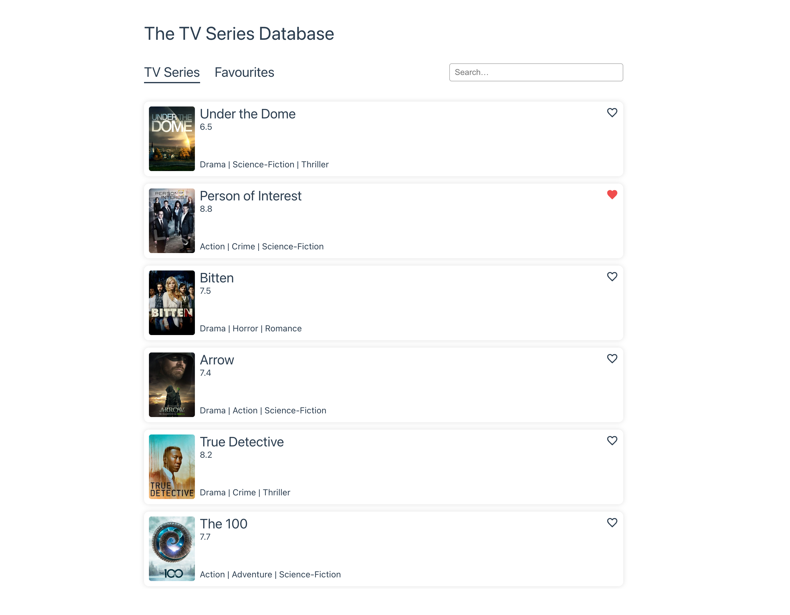
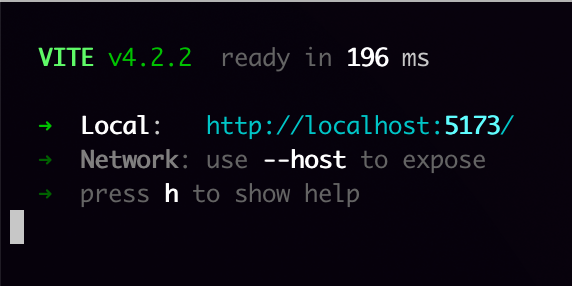

# The TV Series Database



## Getting Started

```sh
git clone git@github.com:RyanHavoc/the-tv-series-database.git
cd the-tv-series-database
npm install
npm run dev
```

✅ Success:

Go to: [http://localhost:5173/](http://localhost:5173/)

## Notes

- The app has tree routes `/`, `/favourites` and `/search` defined through the [router](./src/router/index.ts).
- Favourites are stored in a [Pinia store](./src/stores/favourites.ts) that uses `useStorage` to sync the favourites with `localStorage`. Favourites are retained between reloads.
- There is a [UtilVirtualScroller](./src/components/UtilVirtualScroller.vue) that used `IntersectionObserver` to only render visible shows in the listing. This is used in [AppShowListing](./src/components/AppShowListing.vue) as a reusable component between routes, it just accepts an array of shows and the behaviour happens internally.
- [UtilVirtualScroller](./src/components/UtilVirtualScroller.vue) emits an event when it reaches the bottom of the scrollable element. This is used to fetch more shows on the "TV Series" route, i.e. infinite scrolling.
- I added some "no data" states on "Favourites" and "Search" to improve the UX.
